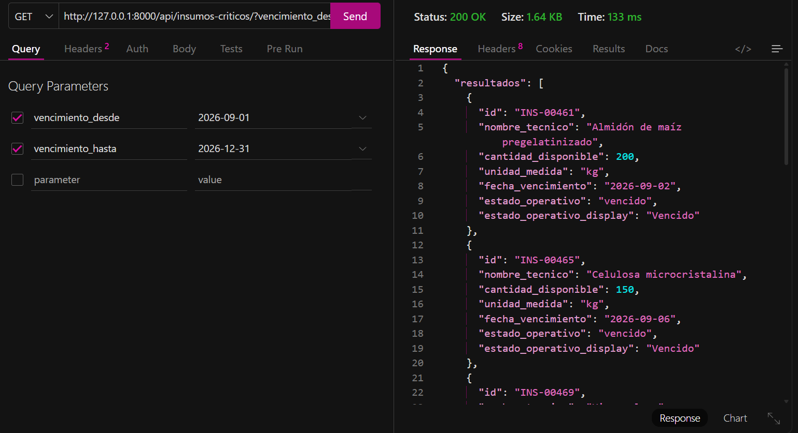

## Preview





## Acerca del proyecto
ImplementÉ una funcionalidad concreta usada por laboratorios farmacéuticos que producen medicamentos bajo normas estrictas. En este contexto, ciertos insumos tienen stock crítico y vencimiento, y múltiples sistemas internos y externos necesitan consultar su disponibilidad real antes de autorizar producción, compras o distribución.

El problema de negocio es preciso. El laboratorio necesita responder, en tiempo real y de forma confiable, qué insumos están disponibles, cuáles están por debajo de un umbral operativo y cuáles ya no pueden utilizarse. Esa información no se consume por humanos sino por otros sistemas que toman decisiones automáticas.

La funcionalidad es un endpoint HTTP de solo lectura que expone el estado actual del stock crítico. El endpoint no modifica datos. No corrige inconsistencias. Refleja exactamente el estado persistido del sistema.

El dominio se organiza alrededor de insumos farmacéuticos. Cada insumo tiene un identificador, un nombre técnico, una cantidad disponible, una fecha de vencimiento y un estado operativo derivado de reglas internas. El estado no se envía como texto libre; se calcula a partir de cantidad y vencimiento.

El endpoint principal lista insumos críticos. Acepta query params para filtrar por estado operativo y por rango de vencimiento. La paginación se controla mediante límite y offset para evitar respuestas masivas y permitir consumo incremental.

Un segundo endpoint permite consultar el detalle de un insumo puntual. Devuelve únicamente la información necesaria para tomar decisiones aguas arriba, sin exponer lógica interna ni historial completo de movimientos.

Las respuestas se entregan en formato JSON usando JsonResponse. Cada respuesta incluye datos estructurados, estado operativo explícito y metadatos mínimos para navegación paginada cuando corresponde.

Las reglas del dominio deciden qué insumos califican como críticos y cómo se calcula su estado. La view coordina la request, extrae parámetros, ejecuta consultas filtradas y ordenadas mediante QuerySets y construye la respuesta. La infraestructura se limita a leer datos persistidos.

Endpoints a implementar:

- GET /api/insumos-criticos/?estado=&vencimiento_desde=&vencimiento_hasta=&limit=&offset=

Devuelve una lista paginada de insumos críticos según filtros aplicados.

- GET /api/insumos-criticos/<id>/

Devuelve el detalle operativo de un insumo específico.

Restricciones:

- Views basadas en funciones.

- QuerySets para filtrar, ordenar y paginar.

- JsonResponse para todas las respuestas.

- No retornar entidades del dominio directamente.

- No modificar estado desde la API.

- No usar frameworks adicionales.

El valor de negocio está en la integración. Esta API permite que sistemas de producción, compras y planificación operen con información confiable, reduzcan riesgos regulatorios y eviten decisiones basadas en datos desactualizados.

## Configuración del proyecto

Este proyecto utiliza variables de entorno para gestionar datos sensibles (como `SECRET_KEY` y credenciales de base de datos), evitando exponerlos en el control de versiones.

### Requisitos previos

- Python 3.x
- pip

### Instalación

1. Cloná el repositorio:
```bash
   git clone https://github.com/luccamaidana/api-stock-critico-django
   cd api-stock-critico-django
```

2. Creá y activá un entorno virtual:
```bash
   python -m venv venv
   source venv/bin/activate  # En Windows: venv\Scripts\activate
```

3. Instalá las dependencias:
```bash
   pip install -r requirements.txt
```

4. Creá un archivo `.env` en la raíz del proyecto, usando `.env.example` como referencia, y completá tus propios valores:

5. Ejecutá el servidor de desarrollo:
```bash
   python manage.py runserver
```

### Seguridad

Las credenciales y claves sensibles se gestionan mediante `python-decouple` y un archivo `.env` (excluido del repositorio vía `.gitignore`), siguiendo buenas prácticas de seguridad en proyectos Django.